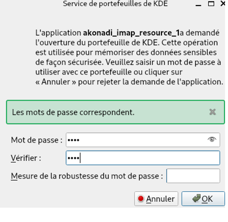

# Postfix, Kmail - Cas pratique

## Informations

| Champ           | Détails                                      |
|-----------------|----------------------------------------------|
| **Auteur**      | William Mbakop                               |
| **Profession**  | étudiant en alternance - BTS SIO SISR        |
| **Version**     | 1.0.0                                        |
| **Date**        | 9 janvier 2025                               |
| **Description** | Postfix, Kmail - Cas pratique                |


## Pré-requis

- [Ubuntu 22.04.05](https://releases.ubuntu.com/jammy/ubuntu-22.04.5-desktop-amd64.iso)
- Ram 4 Go
- Décocher Accélération 3D graphics

## Installation du serveur Mail

```bash

# Passer en mode superutilisateur (root) pour exécuter les commandes avec les privilèges administratifs
sudo su

# Mettre à jour la liste des paquets disponibles depuis les dépôts pour garantir que vous avez les dernières informations
apt update -y

# Mettre à jour tous les paquets installés vers leurs dernières versions disponibles
apt upgrade -y

# Installer le serveur web Apache2, qui permet d'héberger des sites web
apt install apache2 -y

# Démarrer le service Apache2 et vérifier son statut pour s'assurer qu'il fonctionne correctement
systemctl start apache2 && systemctl status apache2

# Connaître l'adresse IP de la machine
ip a

```

Vérifier que Apache a bien été installé en rentrant l’adresse IP de la machine dans le navigateur

```bash
# Ouvrir le fichier de configuration principal d'Apache2 (/etc/apache2/apache2.conf) 
nano /etc/apache2/apache2.conf
    # juste après IncludeOptional sites-enabled/*.conf, ajouter :
    ServerSignature off

# Redémarrer le service Apache2 et vérifier son statut pour s'assurer qu'il fonctionne correctement
systemctl restart apache2 && systemctl status apache2

# Activer le module 'rewrite' d'Apache, qui permet la réécriture d'URL pour améliorer l'optimisation SEO et la gestion des URLs
sudo a2enmod rewrite

# Activer le module 'userdir' d'Apache, qui permet d'accéder aux répertoires publics des utilisateurs (ex. ~/public_html)
sudo a2enmod userdir

# Redémarrer le service Apache2 et vérifier son statut pour s'assurer qu'il fonctionne correctement
systemctl restart apache2 && systemctl status apache2

# Ouvrir le fichier nano /etc/host.conf
nano /etc/host.conf

    # Juste avant multi on, ajouter :
    order 	hosts,bind  

# Ouvrir le fichier /etc/hosts
nano /etc/hosts

```


## Installation de Postfix

```bash
# Installer le serveur de messagerie Postfix, utilisé pour envoyer et recevoir des emails sur le serveur
apt install postfix
```


Renseigner epreuve.lan


```bash
# Se déplacer dans le répertoire de configuration de Postfix où se trouve le fichier principal 'main.cf'
cd /etc/postfix/

# Créer une copie de sauvegarde du fichier de configuration principal 'main.cf' avant de le modifier
cp main.cf main.cf.sauv

# Ouvrir le fichier de configuration 'main.cf' de Postfix
nano main.cf

    # Rajouter ces lignes :
    myhostname = srvub22.epreuve.lan
    mydomain = epreuve.lan
    home_mailbox = Maildir/

    # Ajouter l'adresse ip à cette ligne :
    mynetworks = 127.0.0.0/8 [::ffff:127.0.0.0]/104 [::1]/128 192.168.100.0/24
```


```bash
# Redémarrer le service Apache2 et vérifier son statut pour s'assurer qu'il fonctionne correctement
systemctl restart apache2 && systemctl status apache2

# Installer le paquet de base 'dovecot-core', nécessaire pour faire fonctionner le serveur de messagerie Dovecot
apt install dovecot-core -y

# Installer le paquet 'dovecot-imapd' pour activer le service IMAP sur Dovecot, permettant aux utilisateurs d'accéder à leurs emails via le protocole IMAP
apt install dovecot-imapd -y

# Se déplacer dans le répertoire de configuration de Dovecot pour modifier les fichiers de configuration
cd /etc/dovecot/

# Ouvrir le fichier de configuration principal 'dovecot.conf' de Dovecot avec l'éditeur de texte nano pour le modifier
nano dovecot.conf

    # enlever le # à listen = *, :: pour le décommenter
```

## Installation de KMAIL

```bash
# Installer Kmail
apt-get install kmail -y
```

Ouvrir Gmail via Firefox afin de relier automatiquement notre kmail à Gmail

Ouvrir Kmail en tapant dans la barre de recherche : Kmail


Renseigner le nom, l'adresse mail Gmail et le mot de passe Gmail


Saisir un mot de passe au choix



Sélectionner notre adresse mail dans la catégorie « sélectionnez la clé pour ce compte »


La page Gmail voudra relier Kmail

Cliqur sur autoriser puis cliquer sur notre compte Gmail.


Saisir notre mot de passe Gmail


Fermer la page


Retourner sur Kmail : les dossiers de notre messagerie s’installeront automatiquement. Nous pouvons envoyer dès maintenant nos mails mais aussi en recevoir.


